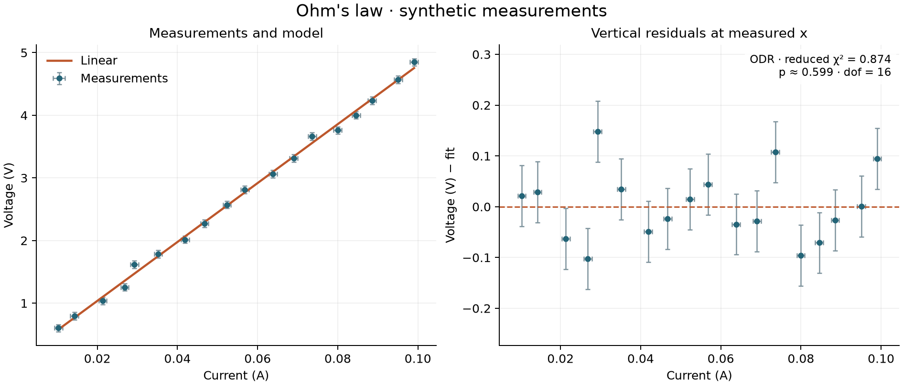

# LabGraphs

**Curve fitting for laboratory measurements, with uncertainties in both axes.**

LabGraphs is a small Python library used in physics laboratory courses at Tel Aviv
University to plot experimental measurements, fit curves, and visualize residuals.
It accepts arrays, CSV files, or Excel columns and reports fitted parameters,
uncertainties, and goodness-of-fit statistics. It grew out of undergraduate physics
labs where the same analysis had to be repeated for each experiment.



- Orthogonal distance regression (ODR) for uncertain x and y; weighted least squares
  (WLS) when x is treated as exact.
- Four built-in models and a small interface for your own equations.
- Validated measurement data and named fit parameters with consistent covariance.
- Matplotlib figures you can customize, save, or display yourself.
- Optional Excel and plotting dependencies. No pandas dependency or GUI requirement.

## Install

Python 3.11 or newer. From a clone of this repository:

```bash
python -m venv .venv
source .venv/bin/activate  # Windows: .venv\Scripts\activate
python -m pip install -e ".[plot,excel]"
```

Use `python -m pip install -e .` for fitting and CSV input only. This project is
installable from source; a PyPI release has not been published.

## Fit measurements

```python
from labgraphs import Dataset, fit, models, plot_fit

data = Dataset(
    x=[0.01, 0.03, 0.05, 0.07, 0.09],
    y=[0.55, 1.51, 2.39, 3.42, 4.29],
    sx=0.001,
    sy=0.06,
    x_label="Current (A)",
    y_label="Voltage (V)",
)

result = fit(data, models.linear)
print(result.summary())
resistance = result.parameter_values["slope"]

fig, (fit_ax, residual_ax) = plot_fit(result, title="Ohm's law")
fig.savefig("ohms_law.png", dpi=200)
```

`sx` and `sy` are **one-standard-deviation uncertainties**, either a scalar shared
by every observation or an array matching the measurements. `sy` is required.
Omit `sx` for exact x and WLS; do not use zero uncertainties. Missing values,
nonfinite numbers, and inconsistent lengths produce an error instead of silently
dropping observations.

Plotting never calls `show()`, closes existing figures, or changes global styles.
For a window, call `matplotlib.pyplot.show()` yourself. Close figures with
`matplotlib.pyplot.close(fig)` when producing many plots.

## Read a file

Columns are selected by name, and those names become the axis labels:

```python
from labgraphs import read_csv, read_excel

data = read_csv(
    "measurements.csv",
    x="Current (A)",
    y="Voltage (V)",
    sx="Current error (A)",
    sy="Voltage error (V)",
)

data = read_excel(
    "measurements.xlsx",
    sheet="Experiment 1",
    x="Current (A)",
    y="Voltage (V)",
    sx="Current error (A)",
    sy="Voltage error (V)",
)
```

Both readers expect a header in the first row. Empty rows are skipped; partially
missing observations are rejected. CSV supports UTF-8 and a custom `delimiter`.
Excel supports `.xlsx`, with sheets selected by name or zero-based index. Formula
cells must have cached values: recalculate and save the file in Excel first.
The reader does not evaluate formulas. For other formats or transformations,
load your data separately and pass arrays into `Dataset`.

## Models and starting values

| Model | Equation | Parameter order |
| --- | --- | --- |
| `models.linear` | `intercept + slope*x` | intercept, slope |
| `models.quadratic` | `intercept + linear*x + quadratic*x**2` | intercept, linear, quadratic |
| `models.exponential` | `offset + amplitude*exp(rate*x)` | offset, amplitude, rate |
| `models.sinusoidal` | `offset + amplitude*sin(angular_frequency*x + phase)` | offset, amplitude, angular_frequency, phase |

Linear and quadratic models have default guesses. Exponential and sinusoidal
models require `initial_guess`; use physically sensible values in the order above.
The exponential rate is negative for decay. Angles are in radians.

Custom models take a vector of x values followed by individual parameters:

```python
import numpy as np
from labgraphs import Dataset, Model, fit


def decay(t, amplitude, lifetime):
    return amplitude * np.exp(-t / lifetime)


model = Model("Decay", decay, parameters=("amplitude", "lifetime"))
data = Dataset([0, 1, 2, 3, 4], [5.02, 3.04, 1.82, 1.13, 0.66], sy=0.05)
result = fit(data, model, initial_guess=[5.0, 2.0])
print(result.parameter_values)
```

Functions must be vectorized and return the same shape as x. The solver is local:
starting values matter, and a converged solution is not proof of a global optimum.
There are no parameter bounds in this API. Equations must remain valid at trial
parameters and adjusted x values; reparameterize positive quantities if needed.

## Real experimental data: an NFW dark matter density profile

A larger worked example, from an undergraduate dark-matter lab: fitting the
Navarro-Frenk-White (NFW) profile

```
ρ(r) = ρ₀ / [(r/rs) · (1 + r/rs)²]
```

to the Milky Way's dark matter density, derived from HI 21 cm rotation-curve
measurements across the whole galactic radius
(`data/milky_way_dark_matter_density.xlsx`, columns `r (kpc)`,
`r_error (kpc)`, `ρ (M☉/kpc³)`, `ρ_error (M☉/kpc³)`):

```python
from labgraphs import Model, fit, plot_fit, read_excel


def nfw_density(r, rho0, rs):
    x = r / rs
    return rho0 / (x * (1 + x) ** 2)


data = read_excel(
    "data/milky_way_dark_matter_density.xlsx",
    x="r (kpc)",
    y="ρ (M☉/kpc³)",
    sx="r_error (kpc)",
    sy="ρ_error (M☉/kpc³)",
)
model = Model("NFW", nfw_density, ("rho0", "rs"))
result = fit(data, model, initial_guess=[1e9, 2.0])
print(result.summary())

fig, _ = plot_fit(result, title="NFW dark matter density profile · Milky Way")
fig.savefig("outputs/nfw_density_profile.png", dpi=180)
```

This recovers a scale density `rho0` and scale radius `rs` for the halo
directly from ODR (both axes carry measurement uncertainty). The full
derivation — turning a 21 cm spectral line into a rotation curve and then
into a density profile — is documented in `Dark Matter (1).pdf`, and the
data-reduction pipeline that produced `density_all.xlsx` lives in a separate
repository: [gavriel44/dark-matter](https://github.com/gavriel44/dark-matter).
Run it with `python examples/nfw_density_profile.py`.

## What the results mean

`result.parameters`, `standard_errors`, and `covariance` use the model's parameter
order. `parameter_values` gives a name-to-value dictionary, `predict(x)` evaluates
the fitted equation, and `summary()` returns a printable report. Data and result
arrays are copied and marked read-only to avoid accidental modification.

By default, `fit(..., absolute_sigma=True)` treats your measurement uncertainties
as absolute. Standard errors are the square roots of the covariance diagonal.
With `absolute_sigma=False`, covariance is multiplied by reduced chi-square,
matching the residual-variance scaling used by the original library. This changes
the reported parameter errors, not the fitted parameters.

The chi-square objective includes weighted corrections in **both** axes for ODR.
`result.residuals` and the residual plot instead show vertical `y - f(x)` at the
original measured x. They are useful for spotting patterns but are not the ODR
objective. `x_adjustments` and `y_adjustments` expose the corrections to the
measured points. See [the statistical conventions](docs/statistics.md) for formulas.

Degrees of freedom are observations minus fitted parameters. The p-value is an
approximate chi-square upper-tail probability, assuming independent Gaussian
measurement errors, an adequate model, and appropriate uncertainty estimates.
It is not the probability that the model is true. Rescaled/relative uncertainties
do not by themselves justify interpreting that p-value as calibrated.

A failed, rank-deficient, or severely ill-conditioned fit raises `FitError` with
an explanation.
Bad inputs raise `ValueError`. The library supports one-dimensional explicit
models with independent errors; correlated observations, joint fits, implicit
models, and confidence bands are outside its current scope.

## Reproduce the examples

```bash
python examples/ohms_law.py
python examples/custom_model.py
python examples/nfw_density_profile.py
```

The first two use fixed random seeds and synthetic observations with known
underlying parameters, and the first saves `outputs/ohms_law.png`. The NFW
example fits real experimental data from
`data/milky_way_dark_matter_density.xlsx` and saves
`outputs/nfw_density_profile.png`. To regenerate the README figure, run
`python examples/ohms_law.py --output docs/ohms_law.png`.

## Development

```bash
python -m pip install -e ".[plot,excel,dev]"
python -m pytest --cov=labgraphs --cov-report=term-missing
ruff check .
ruff format --check .
python -m build
python -m twine check dist/*
```

Tests check numerical results against analytical WLS and Deming-regression
solutions, covariance scaling, nonlinear recovery, solver failures, file input,
and plotting behavior. GitHub Actions runs the suite across supported Python
versions and operating systems, and checks the source/wheel distributions.

The package uses a `src/` layout. `data.py` validates measurements, `models.py`
defines equations, `fitting.py` owns the solver and diagnostics, `io.py` loads files,
and `plotting.py` produces figures. [Migration notes](docs/migration.md) explain
the changes from the original scripts.

ODR is provided by [odrpack](https://hugomvale.github.io/odrpack-python/), following
[SciPy's migration recommendation](https://docs.scipy.org/doc/scipy/reference/odr.html).
SciPy supplies the chi-square distribution. LabGraphs provides the measurement
validation, model/result API, diagnostics, file readers, and plotting workflow.

Licensed under the [MIT License](LICENSE).
